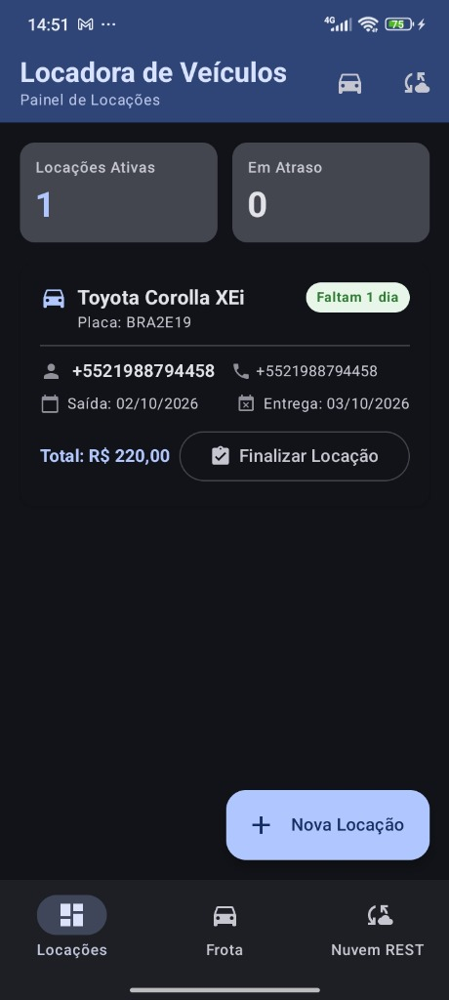
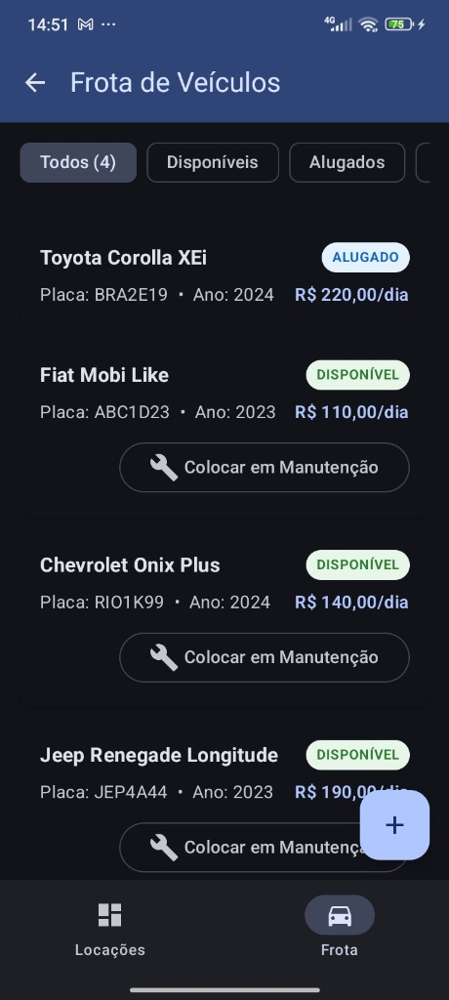
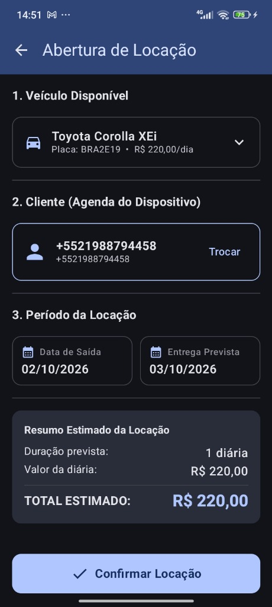
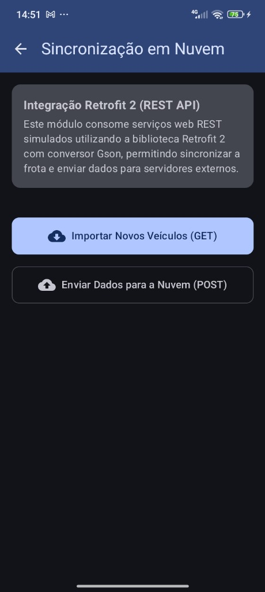

# 🚗 Locadora de Veículos — Aplicativo Mobile Android

Aplicativo nativo desenvolvido em **Kotlin** com **Jetpack Compose** para pequenos locadores de veículos gerenciarem sua frota, selecionarem clientes diretamente da agenda telefônica do dispositivo e controlarem suas locações ativas e históricas.

---

## 🏛️ Arquitetura do Projeto

O projeto adota o padrão arquitetural **MVVM (Model-View-ViewModel)** com separação clara de responsabilidades em camadas:

```
                      ┌───────────────────────────────────────────┐
                      │                 UI Layer                  │
                      │  (Jetpack Compose + Material 3 Screens)   │
                      └─────────────────────┬─────────────────────┘
                                            │
                                  collectAsStateWithLifecycle()
                                            │
                      ┌─────────────────────▼─────────────────────┐
                      │              ViewModel Layer              │
                      │     (StateFlow + Kotlin Coroutines)       │
                      └─────────────────────┬─────────────────────┘
                                            │
                                   Chamadas Assíncronas
                                            │
                      ┌─────────────────────▼─────────────────────┐
                      │             Repository Layer              │
                      │  (VeiculoRepo, ClienteRepo, LocacaoRepo)  │
                      └──────────────┬─────────────────────┬──────┘
                                     │                     │
                       Flow / Queries                      │ Retrofit 2
                                     │                     │ (REST API)
        ┌────────────────────────────▼───────┐   ┌─────────▼──────────────┐
        │          Data Layer (Room)         │   │   Rede / Sincronização │
        │  • VeiculoEntity (Status)          │   │   • LocadoraApiService │
        │  • ClienteEntity (Cache Agenda)    │   │   • RetrofitClient     │
        │  • LocacaoEntity (@ForeignKey)     │   │     (Mock Interceptor) │
        │  • LocacaoCompleta (@Relation)     │   └────────────────────────┘
        └────────────────────────────────────┘
```

### Principais Tecnologias e Bibliotecas
* **Linguagem:** Kotlin 2.2+
* **Interface do Usuário:** Jetpack Compose (100% declarativa, Material 3, sem layouts XML)
* **Gerenciamento de Estado:** `StateFlow` e `collectAsStateWithLifecycle()`
* **Persistência Local:** Room Database 3 (com KSP, 3 tabelas, `@ForeignKey` e `@Relation`)
* **Integração com SO:** `ContentResolver` consultando `ContactsContract.CommonDataKinds.Phone` com permissões em tempo de execução (`READ_CONTACTS`)
* **Rede:** Retrofit 2 + Gson Converter (endpoints de sincronização mockados)
* **Navegação:** Navigation Compose em estrutura Single Activity (`AppNavigation`)
* **Assincronismo:** Kotlin Coroutines (`viewModelScope`, `Dispatchers.IO`) e `Flow`

---

## 📋 Mapeamento de Requisitos Funcionais

| Requisito | Descrição | Status |
|---|---|:---:|
| **RF01.1** | O app inicia diretamente no Dashboard de Locações | ✅ Atendido |
| **RF01.2** | Listagem apenas de locações com status `ATIVA` | ✅ Atendido |
| **RF01.3** | Itens com Modelo, Marca, Placa, Cliente, Telefone, Datas e dias faltantes | ✅ Atendido |
| **RF01.4** | Destaque visual em atraso (borda vermelha e badge quando dias $< 0$) | ✅ Atendido |
| **RF01.5** | Botão Flutuante (FAB) para iniciar "Nova Locação" | ✅ Atendido |
| **RF02.1** | Listagem da frota indicando status (DISPONÍVEL, ALUGADO, MANUTENÇÃO) | ✅ Atendido |
| **RF02.2** | Formulário com Marca, Modelo, Placa, Ano e Valor da Diária | ✅ Atendido |
| **RF02.3** | Validações: Placa brasileira (Mercosul ou antiga), diária positiva, campos obrigatórios | ✅ Atendido |
| **RF02.4** | Status padrão ao cadastrar veículo: `DISPONÍVEL` | ✅ Atendido |
| **RF03.1** | Solicitação de permissão `READ_CONTACTS` em tempo de execução | ✅ Atendido |
| **RF03.2** | Tratamento amigável de recusa da permissão com opção de tentar novamente | ✅ Atendido |
| **RF03.3** | Busca de contatos via `ContentResolver` (`ContactsContract`) | ✅ Atendido |
| **RF03.4** | Filtro de contatos por nome em tempo real | ✅ Atendido |
| **RF03.5** | Retorno do contato selecionado (Nome, Telefone e ID) para a locação | ✅ Atendido |
| **RF04.1** | Seleção restrita apenas a veículos com status `DISPONÍVEL` | ✅ Atendido |
| **RF04.2** | Vinculação do cliente a partir da agenda de contatos | ✅ Atendido |
| **RF04.3** | Seleção de Data de Saída e Entrega Prevista com componente visual `DatePicker` | ✅ Atendido |
| **RF04.4** | Cálculo dinâmico do total estimado (Dias $\times$ Valor da Diária) | ✅ Atendido |
| **RF04.5** | Ao confirmar: Veículo vai para `ALUGADO`, locação salva como `ATIVA` e retorna ao Dashboard | ✅ Atendido |

---

## 📱 Telas Principais do Aplicativo

| 1. Dashboard (Locações) | 2. Frota de Veículos | 3. Abertura de Locação | 4. Sincronização Nuvem |
| :---: | :---: | :---: | :---: |
|  |  |  |  |

### 1. Dashboard (Tela Inicial)
* Exibe contadores de locações ativas e contratos em atraso.
* Lista os contratos ativos detalhando veículo, cliente, datas e badge dinâmico de prazo.
* Permite finalizar a devolução do veículo com um clique, liberando o carro de volta para DISPONÍVEL.
* Botão Flutuante (FAB) para cadastrar nova locação.

### 2. Gestão da Frota de Veículos
* Filtros rápidos por chip: *Todos*, *Disponíveis*, *Alugados* e *Manutenção*.
* Card de cada veículo com placa, ano, valor da diária e badge colorido de status.
* Opção de alternar o veículo entre Disponível e Manutenção.
* Modal para cadastro de novos veículos com validação imediata de placa brasileira e diária (botão `+`).

### 3. Abertura de Locação (Integração com SO)
* Dropdown exibindo apenas veículos que estejam livres na frota (`DISPONÍVEL`).
* Botão de seleção de cliente integrado à **agenda de contatos do dispositivo** (`ContactsContract` / `READ_CONTACTS`).
* Seleção de datas de saída e entrega prevista com cálculo automático do total estimado.
* Ao confirmar, o veículo passa para `ALUGADO` e a locação é registrada como `ATIVA`.

### 4. Sincronização Nuvem (Retrofit 2 REST API)
* Demonstração prática do consumo de API REST externa com conversão Gson.
* Botão **"Importar Novos Veículos (GET)"**: consome serviço web remoto e sincroniza a frota com o banco local Room.
* Botão **"Enviar Dados para a Nuvem (POST)"**: realiza backup/envio de dados para servidores externos.

---

## 🚀 Como Compilar e Executar

### Pré-requisitos
* **Android Studio** (Koala / Ladybug ou superior recomendado).
* **JDK 17 ou 21** instalado e configurado.
* Dispositivo físico ou Emulador Android com API 24 (Android 7.0) ou superior.

### Passos de Instalação e Execução
1. Clone o repositório:
   ```bash
   git clone https://github.com/RodrigoNogueiraTeixeira/Locadora-Mobile.git
   ```
2. Abra o projeto no Android Studio via **File > Open** selecionando a pasta clonada.
3. Aguarde o **Gradle Sync** finalizar o download das dependências.
4. Conecte um dispositivo físico via USB (com Depuração USB ativada) ou inicie um Emulador.
5. Clique em **Run 'app'** (`Shift + F10`) no Android Studio.

### Compilação via Linha de Comando (Gradle)
Para gerar o APK de depuração diretamente pelo terminal:
```bash
./gradlew assembleDebug
```
O APK compilado será gerado em:
`app/build/outputs/apk/debug/app-debug.apk`

---

## 📦 Arquivo APK para Instalação Direta

O arquivo APK compilado e pronto para instalação em dispositivos Android encontra-se disponível na pasta:
* [`release/locadora-app.apk`](release/locadora-app.apk)
